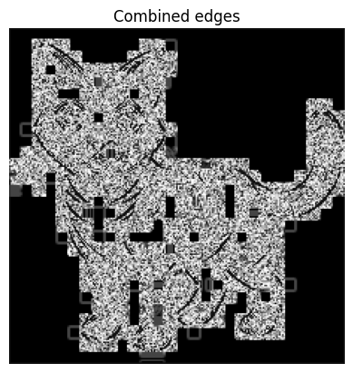
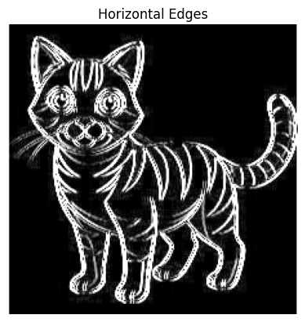
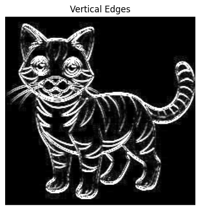
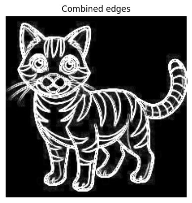
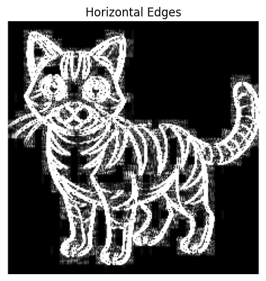
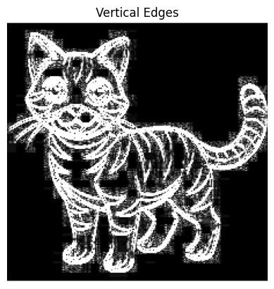
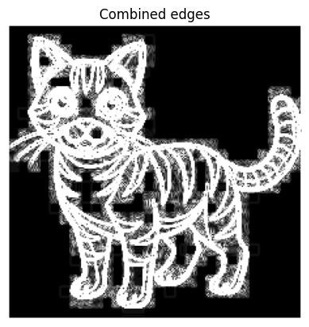
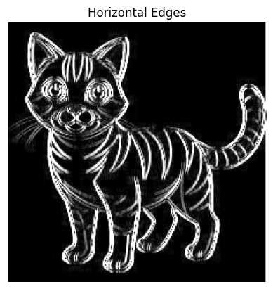
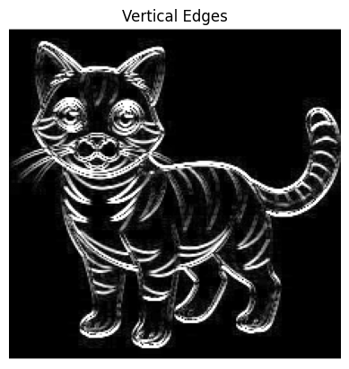
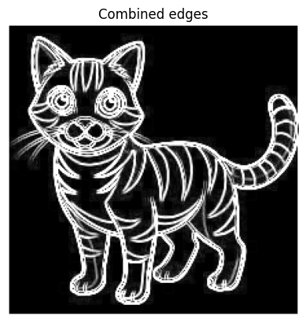

# Edge Detection Using Convolutional Kernels


---

## Introduction

Edge detection is a fundamental tool in image processing, especially for feature detection and extraction. It works by identifying significant transitions in intensity values in images. These transitions typically represent boundaries of objects within the image.

I employed convolution operations using different kernels including:
- **Sobel**
- **Scharr**
- **Prewitt**

Each of these kernels emphasizes changes in intensity in either the horizontal or vertical directions.

---

## Method

### 1. Image Preprocessing

- Grayscale conversion of input image (to simplify the intensity detection).

### 2. Kernel Definitions

I defined kernels for horizontal and vertical edge detection for each operator.

- **Sobel**:
  ```python
  sobel_x = np.array([[-1, 0, 1], 
                        [-2, 0, 2], 
                        [-1, 0, 1]])
  sobel_y = np.array([[1, 2, 1], 
                      [0, 0, 0], 
                      [-1, -2, -1]])
  ```

- **Scharr**:
  ```python
  scharr_x = np.array([[-3, 0, 3], 
                        [-10, 0, 10], 
                        [-3, 0, 3]])
  scharr_y = np.array([[3, 10, 3], 
                        [0, 0, 0], 
                        [-3, -10, -3]])
  ```

- **Feldman**:
  ```python
  feldman_x = np.array([[-1, 0, 1], 
                        [-1, 0, 1], 
                        [-1, 0, 1]])
  feldman_y = np.array([[1, 1, 1], 
                        [0, 0, 0], 
                        [-1, -1, -1]])
  ```

### 3. Convolution Implementation

I implemented a convolution function from scratch using nested loops and applied each kernel to the input image. For each method:
- Convolve with X and Y kernels
- Combine results using the magnitude:  
  
  Edge Magnitude= sqrt{G_x^2 + G_y^2}

  When I tried to combine them the first time there was a weird image that came due to overflow of values when it was in uint8 type so I switched the type to float32.
  
  

---

## Results and Comparisons

### Visual Comparisons

Images were generated for each kernel's X and Y edge detection as well as the combined edge magnitude. These visual outputs show the differences in sensitivity and sharpness of the edge detection:

| Operator | Horizontal | Vertical | Combined |
|----------|------------|----------|----------|
| Sobel    |  |  |  |
| Scharr   |  |  |  |
| Feldman  |  |  |  |

### Observations

- **Sobel** provided good overall edge detection with balanced results.
- **Scharr** produced sharper edges due to higher emphasis on pixel changes, especially useful for fine details.
- **Feldman** was the least sensitive, and gave a more generalized detection that may be suitable for noisier images.

---

## Conclusion

All three kernels achieved the objective of detecting image edges. The Scharr operator, due to its higher sensitivity, performed best in terms of clarity, followed by Sobel and then Prewitt. The convolution-based edge detection provides a foundation for more complex computer vision applications.

---


