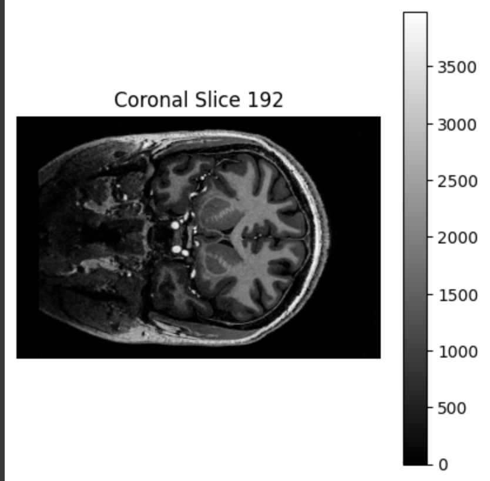

# MRI Data Visualization Report

## Tasks

### 1. Reading and Loading Data

* **NIfTI**: Loaded using nibabel.load()
* **DICOM**:First I tried to find a good dicom folder but after trying out three from different sources there were too many errors occuring due to unavailability of the latest version of pylibjpeg in colab.So, I converted one of the given nii files with the help of gpt and manually added some sample metadata that was missing. Then I read individual slices using pydicom, then sorted and stacked based on ImagePositionPatient

### 2. Metadata Exploration

#### NIfTI

* Extracted:

  * Data shape
  * Affine matrix (for orientation and voxel spacing)
  * Header info (datatype, descrip, etc.)

#### DICOM

* Extracted from one slice:

  * PatientName, StudyDate, Modality
  * PixelSpacing, SliceThickness, ImagePositionPatient, ImageOrientationPatient

### 3. Stacking DICOM Slices

* Read all .dcm files in a folder
* Sorted using the z-position from ImagePositionPatient
* Constructed a 3D NumPy array volume

### 4. Visualization

* Used matplotlib to show:

  * **Axial** view (slice along z-axis)
  * **Coronal** view (slice along y-axis)
  * **Sagittal** view (slice along x-axis)
* Added titles and axis labels to clarify orientation

### 5. Orientation Handling

* **NIfTI** uses a 4x4 affine matrix:

  * Maps voxel indices to real-world (x, y, z) coordinates
  
* **DICOM** uses orientation tags:

  * ImageOrientationPatient defines row and column direction vectors
  * ImagePositionPatient provides physical location of top-left corner
  * Requires correct stacking to interpret 

### 6. Format Comparison

| Feature             | NIfTI                           | DICOM                                   |
| ------------------- | ------------------------------- | --------------------------------------- |
| Intended Use        | Research                        | Clinical                                |
| Metadata Storage    | In single file header           | Per-slice metadata                      |
| File Format         | Single .nii or .nii.gz file | Multiple .dcm files (one per slice)   |
| Orientation         | Affine matrix                   | ImagePosition + OrientationPatient      |
| Volume Construction | Direct (3D array)               | Requires stacking and sorting           |
| Tooling in Python   | Simple with nibabel           | Requires pydicom + logic for stacking |

---

## Screenshots

* Axial view shown for both DICOM and NIfTI data
* 
* 
* coronal and sagittal for NIfTI
*  
*  
 

---

## Notes

* For DICOM, assumed some sample metadata because I had to convert nii to dcm
* Used ImagePositionPatient (z-axis) to sort slices
* NIfTI data was already in 3D form; no stacking needed

---

## Challenges Faced

* DICOM files required careful sorting and converting nii to dicom was not easy
* Understanding affine matrix 
* Metadata formats between DICOM and NIfTI

---

