Task 1 and Task 2 (Done by Dhyanav)

Task 1

The CIFAR10 dataset is already clean, shuffled and neatly labelled. So, I directly moved to data augmentation. I divided 60,000 images of CIFAR-10 into 6 batches of 10,000 each. They were used for flipping, rotating, cropping, adding noise, cut-out and mixup.

Cut-out: I randomly cut a square of 6 by 6 from the image. Using this technique helps the model learn better since it tries to identify an image without a certain part. It reduces dependence on specific parts of the image. I decided to use 6 by 6 after some experimentation. I feel it was in the middle, not too small to be practically ineffective and not too large to remove all key features entirely.

Mixup: It selects a random image and imposes it on chosen images. The formula used is  
	Xnew \= alpha\*X1 \+ (1-alpha)\*X2  
Here, Xnew is the final result, X1 is the base image and X2 is the image that is being imposed. After some experimentation, I used alpha \= 0.75.

Then, I combined it into the original dataset, doubling its size. Then, I split data. 95,000 images for training, 10,000 for validation and 15,000 for testing.

Now, I moved to task 2

Task 2

ANN:  
I started with 2 hidden layers, but gradually increased the layers so it was computationally viable. Finally, there are 4 layers. I also doubled the number of neurons in each layer and stuck with it since it increased accuracy without overfitting.

I trained for 15 epochs. Since, loss is steadily decreasing, implementing early stopping was not useful. Increasing epochs led to an increase in difference between training accuracy and test accuracy. I finally decided to use 15 epochs since the difference was only 5%.

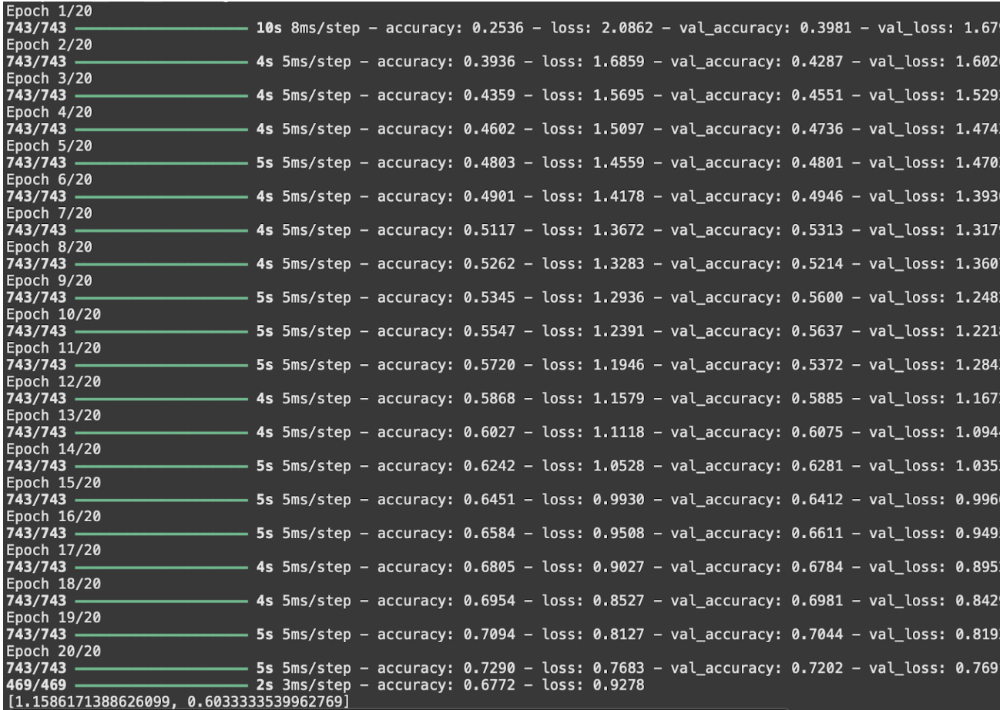  
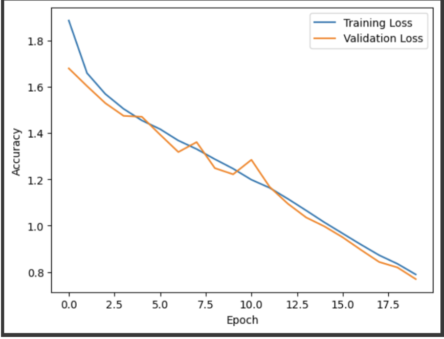 

CNN:  
I used a similar process as in ANN. Gradually increasing the number of layers and number of neurons in each layer till I was satisfied with the result. I tried implementing early stopping but it was useless as only the last three layers were showing signs of saturation and early stopping evaluates accuracy of three layers before stopping training.

In both, I used ADAM optimiser, so learning rate was not a part of experimentation as ADAM adjusts learning rate accordingly. I increased batch size from 32 to 256 to speed up training while also maintaining accuracy. (After 256, accuracy started to drop.)

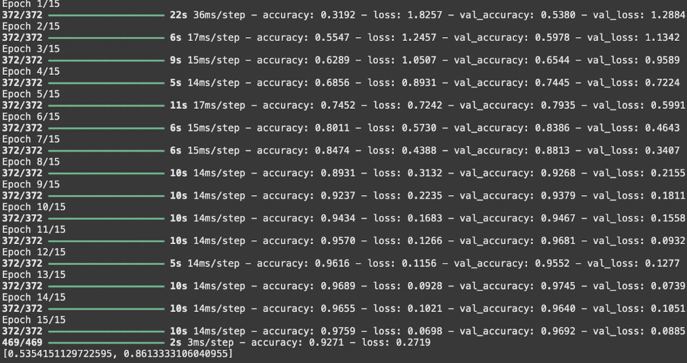  
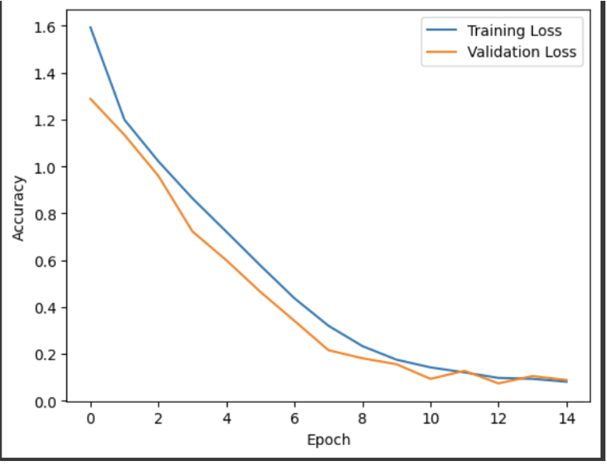   
I also trained the same models, ANN and CNN on raw CIFAR10 data and the difference in accuracy was significant.

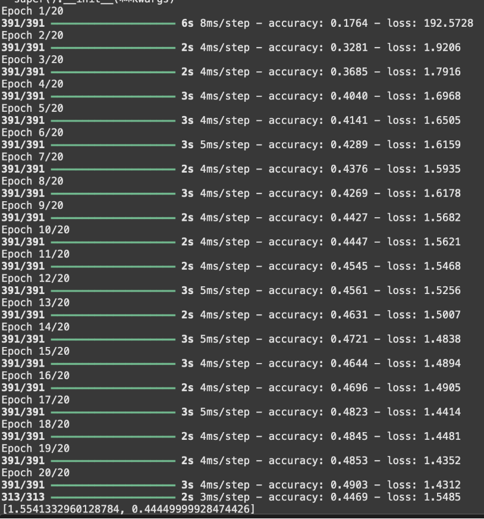 
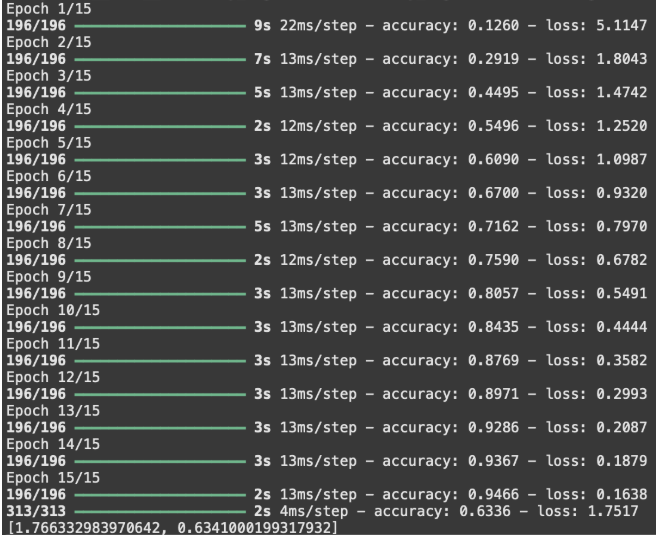 

On the CNN model, I implemented one-pixel attack. THis is a type of attack where the attacker randomly selects a pixel and manipulates it. It is known to reduce accuracy of the model by a significant margin. But since I implemented cutout in data augmentation, model accuracy only dropped from 91.24% to 83.34

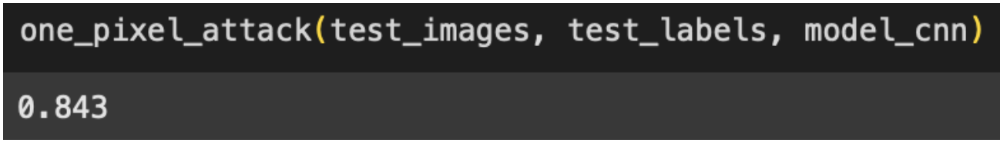 

Task 3-6(Sumit and Shikhar)  
AlexNet, LeNet, VGG16(Sumit)

LeNet: \~60K parameters. A shallow network with 2 convolutional layers.  
Epochs-15  
Batch Size-128  
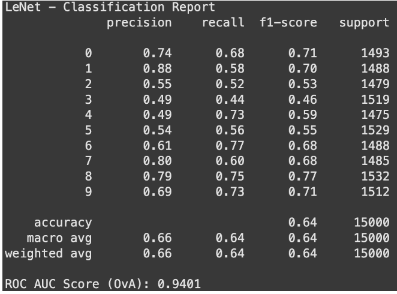  
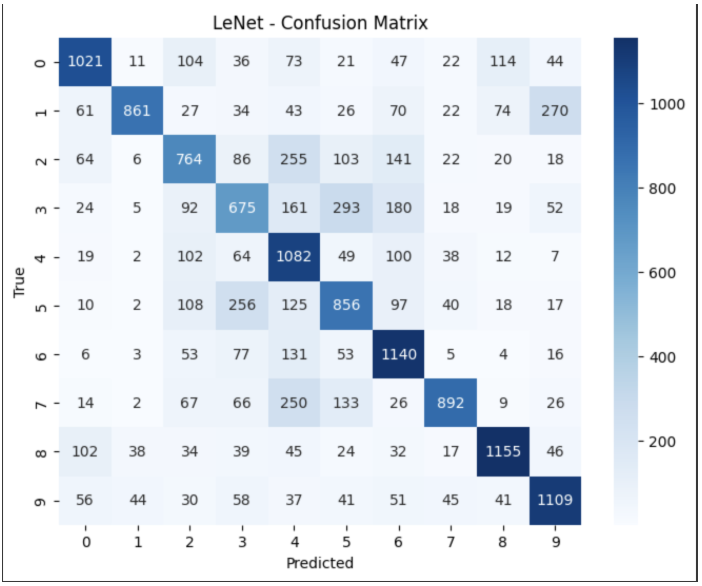 

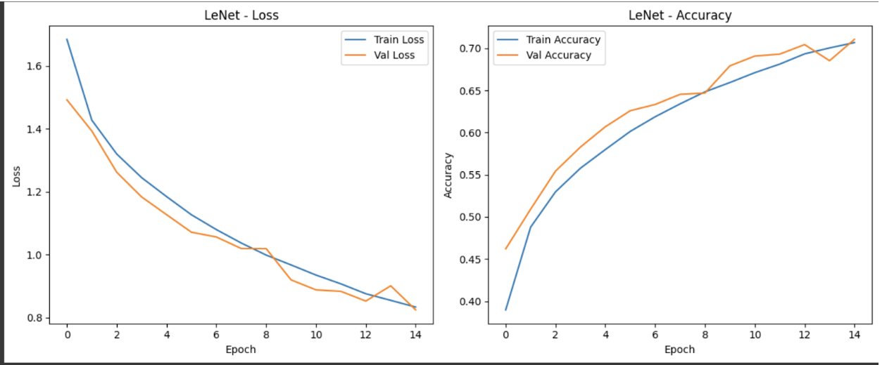 

AlexNet: \~60M parameters. A deeper architecture with 5 convolutional layers. It handles larger input variations better.

Epochs: Initially tried 15 but it was taking much longer than LeNet so switched to 5\.

Batch Size-128

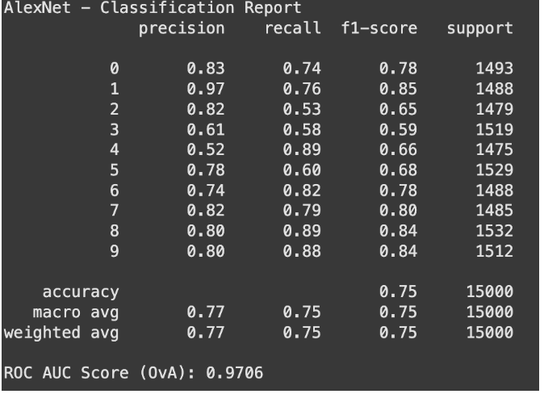 

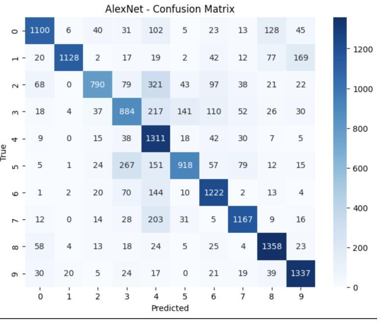 

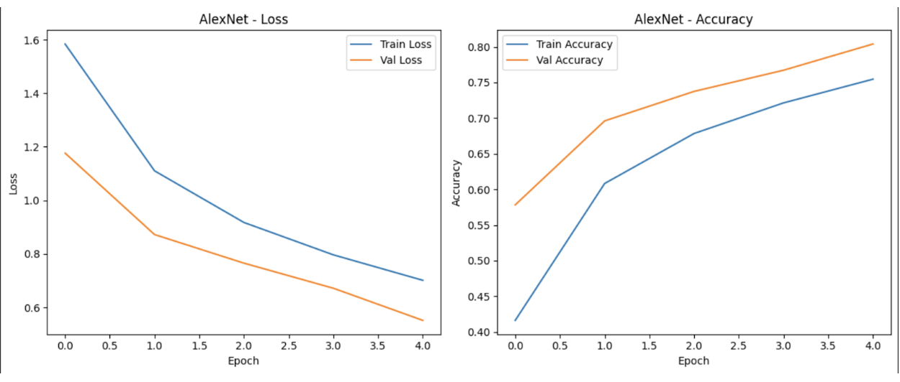 

VGG16: \~138M parameters. A very deep model with 13 convolutional layers. 

Epochs: 5(same problem as AlexNet)

Batch Size: 128

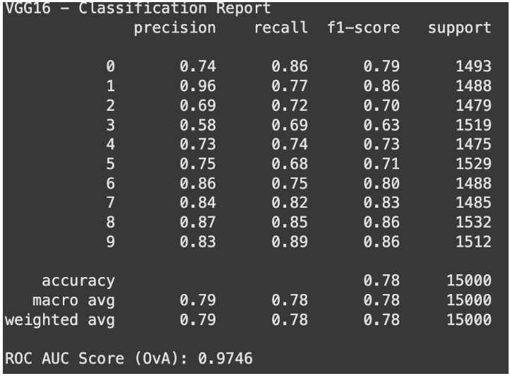 
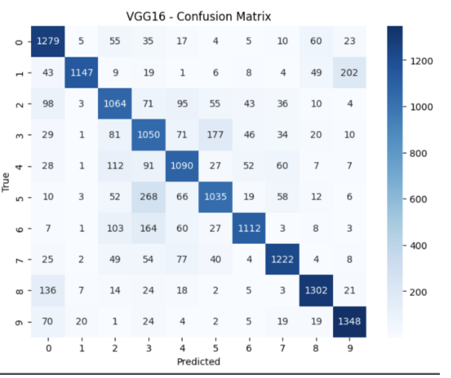 

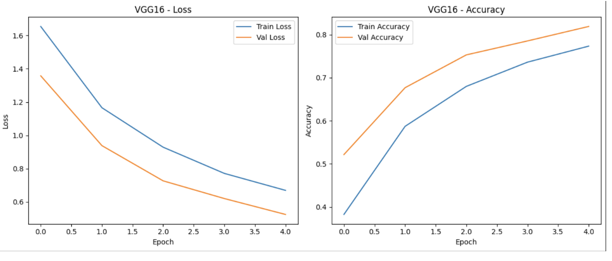 

| Model | Accuracy | Precision | Recall | F1-score | ROC-AUC(OvA) |
| :---: | :---: | :---: | :---: | :---: | :---: |
| LeNet | 0.64 | 0.66 | 0.64 | 0.64 | 0.9401 |
| AlexNet | 0.75 | 0.77 | 0.75 | 0.75 | 0.9706 |
| VGG16 | 0.78 | 0.79 | 0.78 | 0.78 | 0.9746 |

 (here precision, recall, and f1 score are the macro avg)

| Factor | LeNet | AlexNet | VGG16 |
| :---: | :---: | :---: | :---: |
| Overfitting | High | Medium | Low |
| Training Time | Low | Medium | High |
| Generalization | Poor | Decent | Good |

Conclusion:

\-VGG16 gave the best results in terms of accuracy, F1-score, and AUC.

\-LeNet was unsuitable for CIFAR-10 due to its simplicity.

\-AlexNet was a good balance between complexity and performance.

# TRANSFER LEARNING IMPLEMENTATION

# VGG 19, ResNet50, ResNet152 (Shikhar)

VGG19 \-  
144M Parameters  
Has Three more convolution layers than VGG16.  
Epochs \- 5  
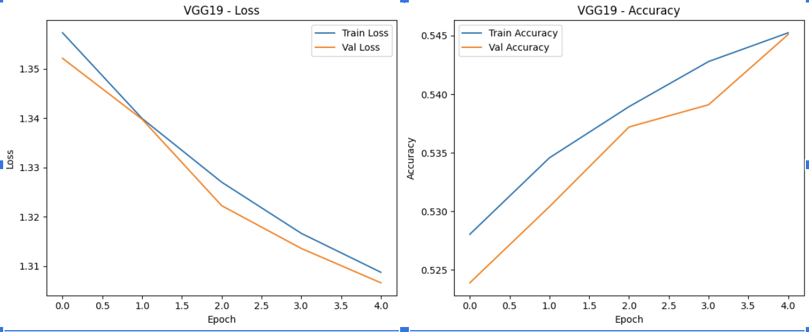  
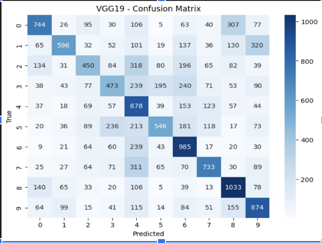 
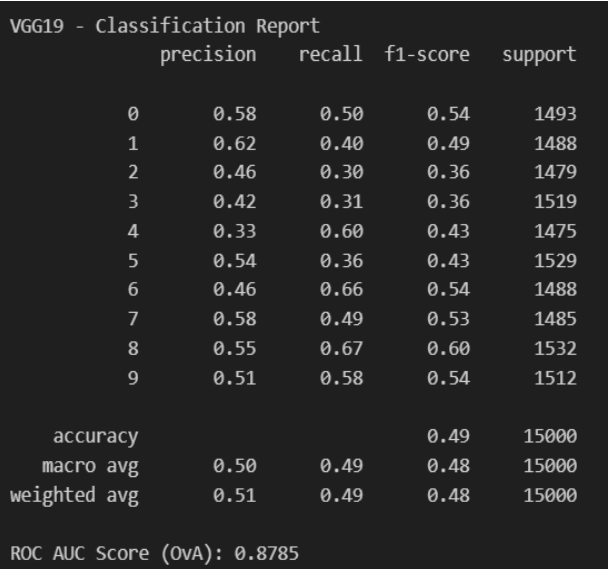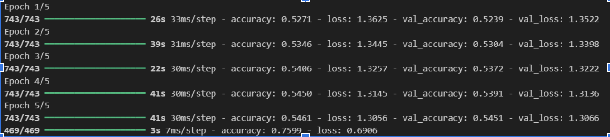

## Resnet50 and 152

Resnets employ something called skip connections, which makes some neurons bypass some layers in the middle, minimising the exploding gradient problem and allowing deeper richer feature extraction.   
While they are generally better than VGG, for a problem simple like MNIST, it is **overkill** and leads to lesser accuracy than VGG and simpler models.  
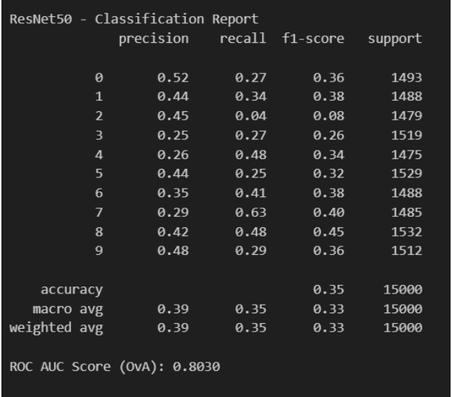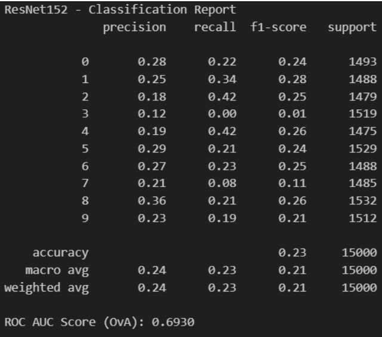

####  Also, another conclusion that we can take from this is, that training models from scratch would always lead to better results than transfer learning since we lose feature extraction in compensation of computation cost.

We could also train for more epochs to further illustrate benefits of transfer learning.  

